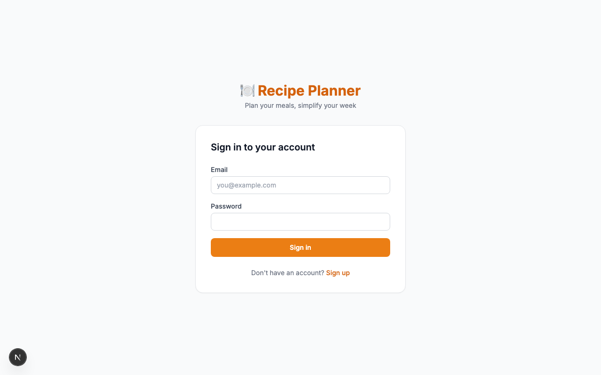
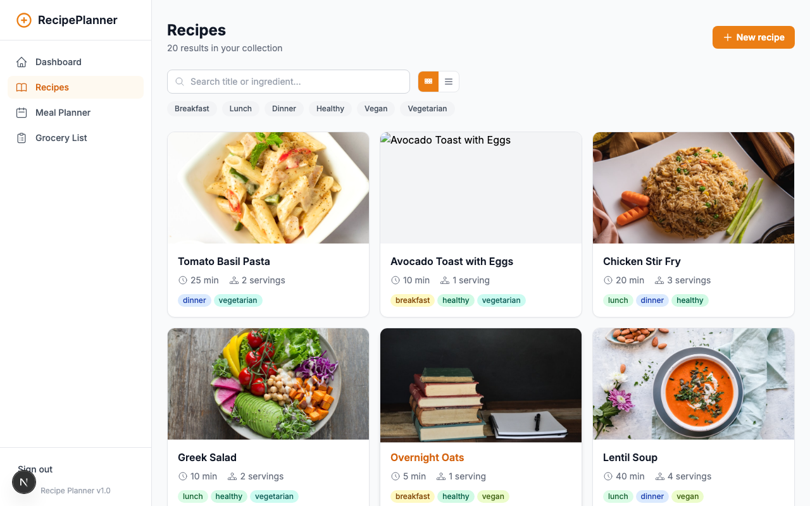
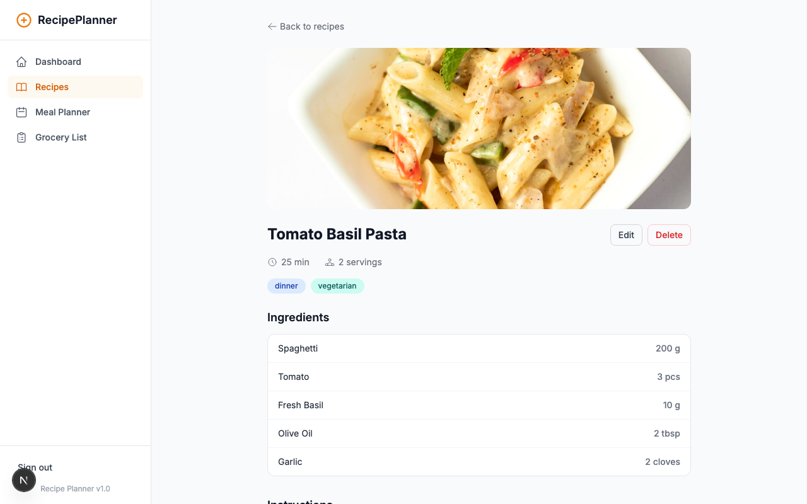
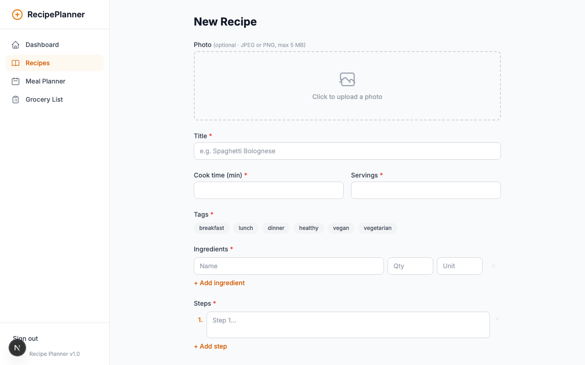
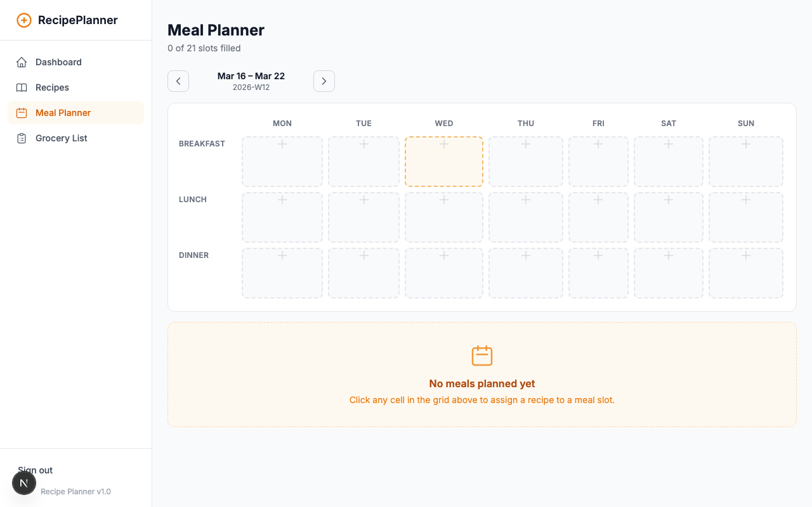
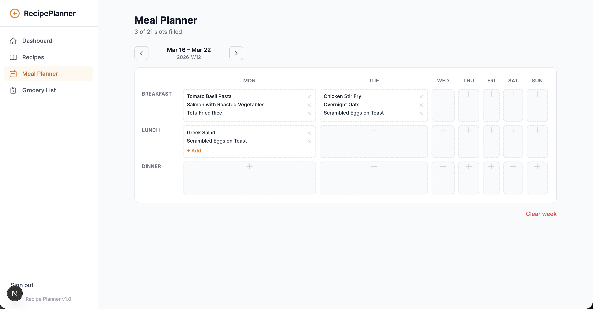
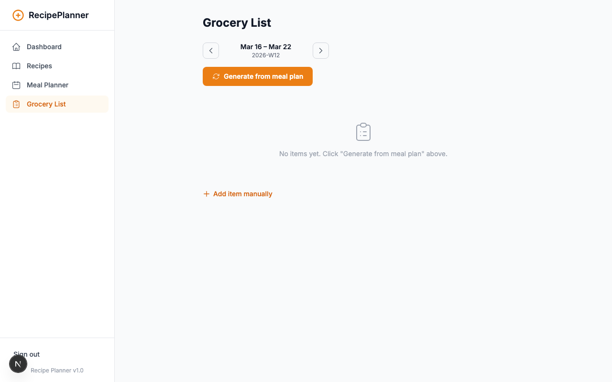
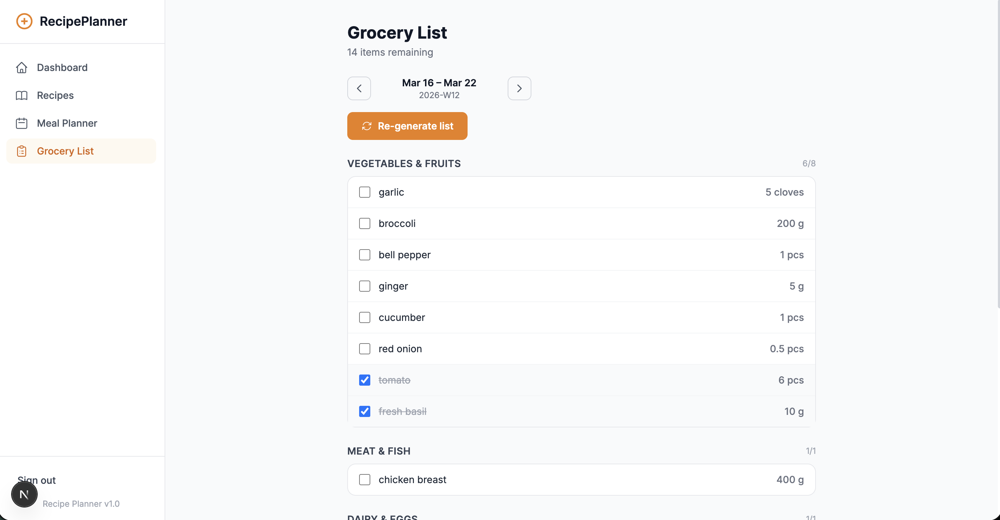

# Recipe Planner

A full-stack meal planning application built with **Next.js 15**, **TypeScript**, and **Supabase**.

> **Live Demo**: *(Vercel URL will be added after deploy — see T106)*

## Features

- **Recipe Collection** — Create, edit, and delete personal recipes with ingredients and steps
- **Meal Planner** — Assign recipes to any day-of-week × meal-type slot for the current or future weeks
- **Multi-Recipe Meal Slots** — Assign up to 3 recipes per meal slot for flexible weekly planning
- **Grocery List Generator** — Auto-aggregate ingredients from your meal plan; add and check off items
- **Dashboard** — Quick overview of your week at a glance
- **Authentication** — Email/password sign-up and login powered by Supabase Auth
- **Cloud persistence** — All data stored per-user in Supabase PostgreSQL; access from any device

---

## Screenshots

### Login


### Recipe Collection


### Recipe Detail


### Create Recipe


### Meal Planner


### Multi-Recipe Slot


### Grocery List




---

## Tech Stack

| Layer | Technology |
|---|---|
| Framework | Next.js 15 (App Router) |
| Language | TypeScript 5 (strict) |
| Styling | Tailwind CSS v4 |
| Backend | Supabase (PostgreSQL + Auth) |
| Testing | Playwright (MCP + E2E) |
| Deployment | Vercel |

---

## Local Setup

### Prerequisites

- Node.js 20+
- A [Supabase](https://supabase.com) project (free tier works)

### 1. Clone and install

```bash
git clone <repo-url>
cd recipe-planner
npm install
```

### 2. Configure environment variables

```bash
cp .env.local.example .env.local
```

Open `.env.local` and fill in your Supabase credentials from the Supabase dashboard → Project Settings → API:

```env
NEXT_PUBLIC_SUPABASE_URL=https://your-project.supabase.co
NEXT_PUBLIC_SUPABASE_ANON_KEY=your-anon-key
SUPABASE_SERVICE_ROLE_KEY=your-service-role-key
```

### 3. Run the database migration

In the [Supabase SQL Editor](https://supabase.com/dashboard/project/_/sql), run the contents of:

```
supabase/migrations/001_initial_schema.sql
```

This creates all 8 tables, RLS policies, and the auto-create trigger for `user_profiles`.

### 4. Start the development server

```bash
npm run dev
```

Open [http://localhost:3000](http://localhost:3000) — you'll be redirected to `/login`.

### 5. Register and start planning

Register a new account → 20 starter recipes are automatically seeded on first login.

---

## Environment Variables

Copy `.env.local.example` to `.env.local` and fill in the values below. All variables are required.

| Variable | Description | Example |
|---|---|---|
| `NEXT_PUBLIC_SUPABASE_URL` | Your Supabase project URL | `https://xxxx.supabase.co` |
| `NEXT_PUBLIC_SUPABASE_ANON_KEY` | Supabase anonymous (public) key | `eyJhbGci...` |
| `SUPABASE_SERVICE_ROLE_KEY` | Supabase service role key (server-side only) | `eyJhbGci...` |

Find these values in your Supabase dashboard → **Project Settings → API**.

---

## Project Structure

```
src/
├── app/
│   ├── (auth)/          # Login + Signup pages (no nav layout)
│   ├── api/             # Route Handlers (auth, recipes, meal-plans, grocery-lists)
│   ├── recipes/         # Recipe list + detail + edit pages
│   ├── meal-planner/    # Weekly meal planning UI
│   ├── grocery-list/    # Grocery list UI
│   └── dashboard/       # Dashboard overview
├── context/             # React contexts (Auth, Recipe, MealPlan, Grocery)
├── lib/
│   └── supabase/        # Client, server, admin clients + types + mappers
├── services/            # Pure business logic functions (unchanged)
├── data/                # Seed recipes + supabase-seed helper
└── types/               # Shared TypeScript domain types
supabase/
└── migrations/          # SQL DDL files
```

---

## Running Tests

```bash
# Run all 90 unit tests
npx jest tests/unit --no-coverage --forceExit
```

---

## Deployment (Vercel)

See [specs/002-supabase-migration/quickstart.md](specs/002-supabase-migration/quickstart.md) for full Vercel deployment steps.

**Quick summary:**
1. Push branch to GitHub
2. Connect repo to Vercel at [vercel.com/new](https://vercel.com/new)
3. Add env vars: `NEXT_PUBLIC_SUPABASE_URL`, `NEXT_PUBLIC_SUPABASE_ANON_KEY`, `SUPABASE_SERVICE_ROLE_KEY`
4. Deploy — app will be live at your Vercel URL

---

## Specifications

- [Spec 001 — Recipe Planner App](specs/001-recipe-planner-app/)
- [Spec 002 — Supabase Migration](specs/002-supabase-migration/)
